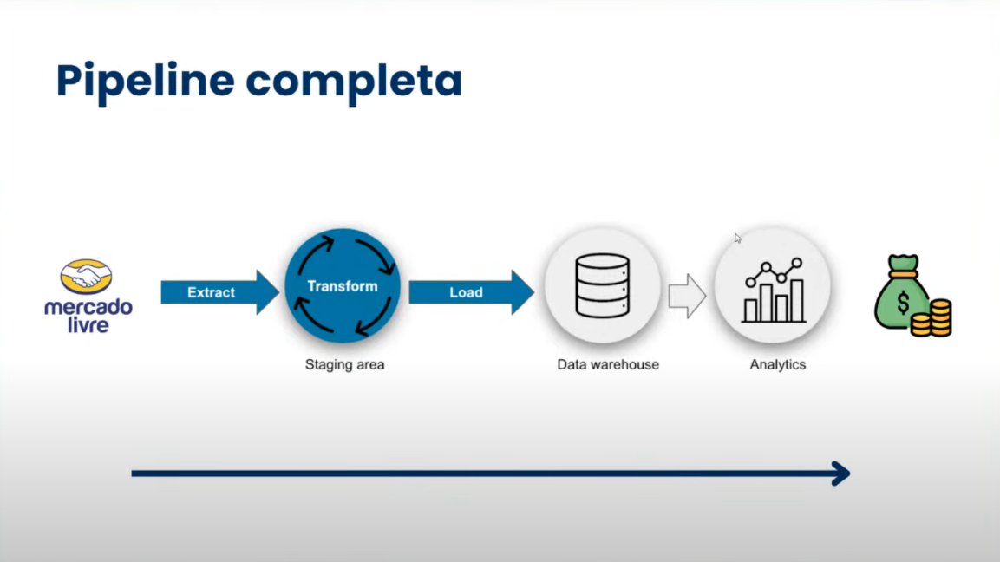

# Projeto Web scraping - Mercado Livre

## Uma solução Pipeline ETL para monitorar preço

### Ferramentas utilizadas:

- Python
- Scrapy para extrair os dados
- Pandas para transformar e fazer o load
- Streamlit para o frontend
- SQL para armazenar os dados

Neste projeto focamos em buscar dados dos preços de Tênis Esportivos dentro do ML com foco em Pesquisa de Mercado.

### Objetivo principal para avaliar:

- Quais marcas são mais encontradas até a 10 página
- Qual o preço médio por marca
- Qual a satisfação por marca

Para montar a estratégia de pricing.

URL: https://lista.mercadolivre.com.br/tenis-corrida-masculino

